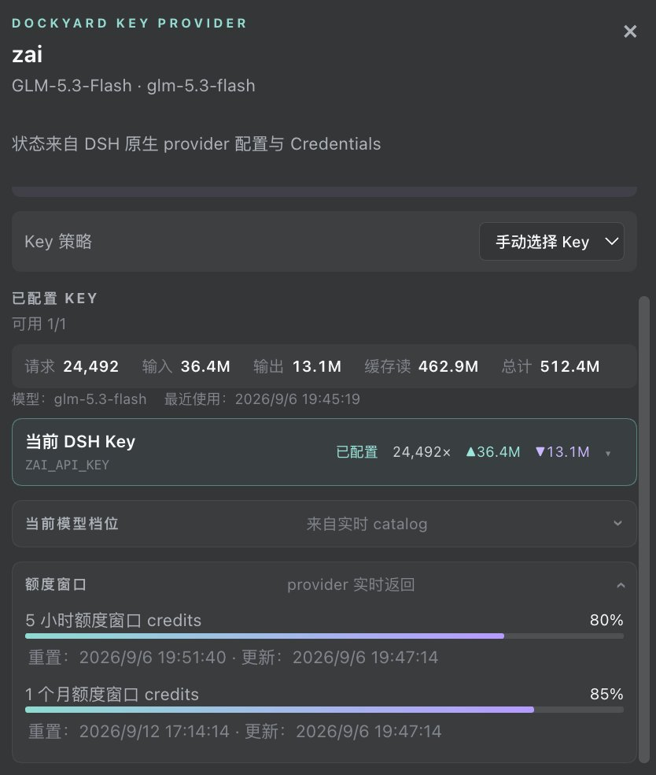
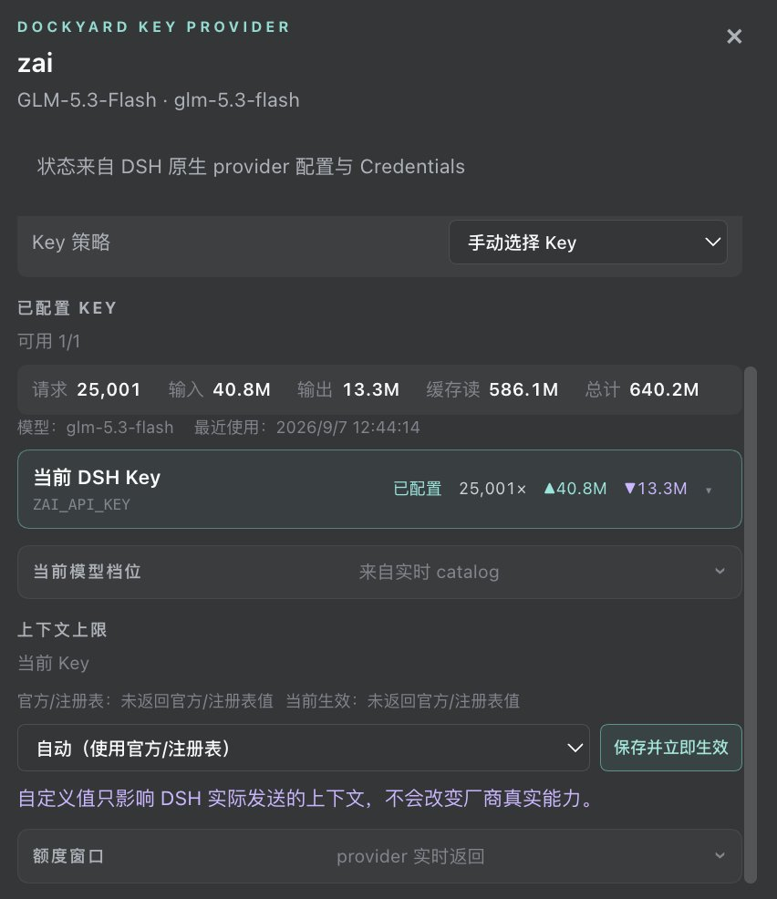

<div align="center">

# 🔑 dsh-oauthpro · Provider 账户池与额度面板

**给 [DeepSeek Harness](https://github.com/deepseek-ai/deepseek-harness) 装上 provider 账户中枢:OAuth 账户池、原生 Key 池、实时余额/额度、三平台自动打开的授权流——macOS / Windows / Linux 一个插件全搞定。**

[](https://github.com/topics/dsh-plugin)
[](https://www.npmjs.com/package/dsh-oauthpro)
[](https://github.com/meyaomiao/dsh-oauthpro/actions/workflows/ci.yml)
[](./LICENSE)


*CI 在 ubuntu / windows / macos 三平台真机跑同一套 243 项测试,全绿才发版。*

</div>

## ⭐ 欢迎点星收藏

如果 dsh-oauthpro 帮到了你，欢迎到 [GitHub 仓库](https://github.com/meyaomiao/dsh-oauthpro) 点个 Star ⭐，让更多 DSH 用户看到它。问题与建议请提 Issue。

## 📋 兼容性

| 插件版本 | 状态 | 对应 DSH |
|---|---|---|
| **0.1.2**（当前） | ✅ | **0.1.5-rc.1 / 0.1.5-rc.2**（及之后的 0.1.5 线）；同时覆盖 0.1.1-rc.2 ～ 0.1.2-rc.1 |

### 本次升级功能变化

- **官方已有的交给官方**：不画赞踩、不画交付文件卡。本插件只做账户池 / 额度 chip。
- 无功能移除。chip 在查不到额度时仍显示「订阅管理」入口，可点开再查。
- 三个注入包（`dsh-api-remotes` / `dsh-client-ui-model-selection` / `dsh-client-ui-conversation`）在 0.1.5 上 API 与 0.1.2 核对为零 diff。

---

## ✨ 截图速览

| Provider 弹窗:套餐 + 额度窗口 + 重置时间 |
|---|
|  |

| Key 池:凭证状态 + 用量台账 + 上下文上限覆写 |
|---|
|  |

**输入框底栏 chip**:有额度时显示剩余百分比 + 渐变进度条(如 `80% ▬▬▬`),无额度的 provider 回退显示 Key 数量;点击打开上方弹窗。

## 🚀 核心能力

- **原生 Key 池面板**:每个 API Key provider 一个弹窗——添加/移除 Key、手动/轮询/失败转移三种策略、请求级换 Key 不改写 provider 激活配置;Key 用量(请求数、输入/输出/缓存 token)逐条入账
- **实时余额/额度**:刷新即查,不猜不伪造——
  - **DeepSeek 兼容网关** → `GET /user/balance` 余额
  - **OpenRouter 兼容网关** → `GET /credits` 余额
  - **z.ai / 智谱 GLM Coding Plan** → `GET /api/monitor/usage/quota/limit`:5 小时 + 月度两个 credits 窗口、使用百分比、重置时间、套餐名
  - 自定义 provider 按以上三族自动探测;都不兼容则给出明确探测诊断,绝不显示假百分比
- **OAuth 账户池**:Codex / Claude / Cursor / Grok / Antigravity 等订阅制 provider 的浏览器授权流(PKCE + state 校验),授权页**三平台自动打开**(macOS `open` / Windows `cmd /c start` / Linux `xdg-open`),loopback 与 manual-code 双回调
- **实时模型目录**:OAuth provider 接官方实时目录(如 Codex 的 gpt-5.6 系列),合并本地注册表,官网上新模型即刻可见
- **上下文上限覆写**:官方/注册表值缺失时可自定义,只影响 DSH 实际发送的上下文
- **composer chip**:额度优先、Key 数量兜底,点击弹窗、悬停见模型名
- **token 台账**:按 provider/account 维度持久化请求与 token 计数,「清空全部用量」一键重置

## 📦 安装

```bash
dsh plugin --profile web add github:meyaomiao/dsh-oauthpro
```

重启 `dsh web` 后,输入框底栏出现 provider chip;硬刷新(Cmd/Ctrl+Shift+R)确保 client 为最新。

### API Key 配置示例

`~/.dsh/settings.yaml` 的 `llm-pi-ai.providers` 下:

```yaml
  zai:
    apiKeyEnv: ZAI_API_KEY
    models:
      - glm-5.3-flash
```

Key 值放 `~/.dsh/.credentials.yaml`:

```yaml
refs:
  ZAI_API_KEY: <your-key>
```

OAuth 类 provider(Codex 等)不填 Key,在弹窗里点登录走浏览器授权即可。

## 🔩 工作原理

```
┌─ client(lib/client.js)────────────┐   ┌─ host(dist/index.mjs)─────────────┐
│ composer chip + provider 弹窗      │ ⇄ │ OAuth 账户池 / Key 池 / 刷新编排    │
│ typert RPC → remote.dockyard      │   │ 余额/额度探测(DeepSeek/OpenRouter/ │
│ slots: conversation.input.left    │   │ z.ai 三族) / token 台账 / 状态落盘  │
└───────────────────────────────────┘   └───────────────────────────────────┘
```

- 凭证只经 **DSH Credentials**(`~/.dsh/.credentials.yaml`)落盘,浏览器不存 Key、不回显
- 余额/额度探测按 baseURL 自动识别协议族;Windows 上无系统级 Keychain 时兜底存储自动降级并明确提示,主路不受影响

## 🧪 平台兼容

| 平台 | 状态 | 说明 |
|---|---|---|
| macOS | ✅ 完整 | Keychain 兜底存储 + 授权页自动打开 |
| Windows | ✅ 核心全量 | 授权页自动打开(`cmd /c start`);CI windows-latest 真机跑全套测试 |
| Linux | ✅ 核心全量 | 授权页自动打开(`xdg-open`) |
| Cursor / Antigravity 桌面凭证扫描 | macOS 专属 | 其他平台自动跳过,回退 env 等替代源 |

## 🛠 开发

```bash
npm install
npm run build   # inject 门禁校验 → 平台构建 → client/host 产物
npm test        # 243 项测试(本地需 node ≥ 22.19 或 ≥ 24)
```

- 产物:`packages/dsh-plugin/lib/client.js`(client)+ `packages/dsh-plugin/dist/index.mjs`(host);DSH 加载的是产物不是 src
- `npm run build` 第一步即校验 `dsh.client.inject` 与本机 DSH 安装一致,平台包漂移在构建期拦截
- 提交走 workflow:Issue → `issue-N-slug` 分支 → PR

## 📄 License

[MIT](./LICENSE) © meyaomiao
